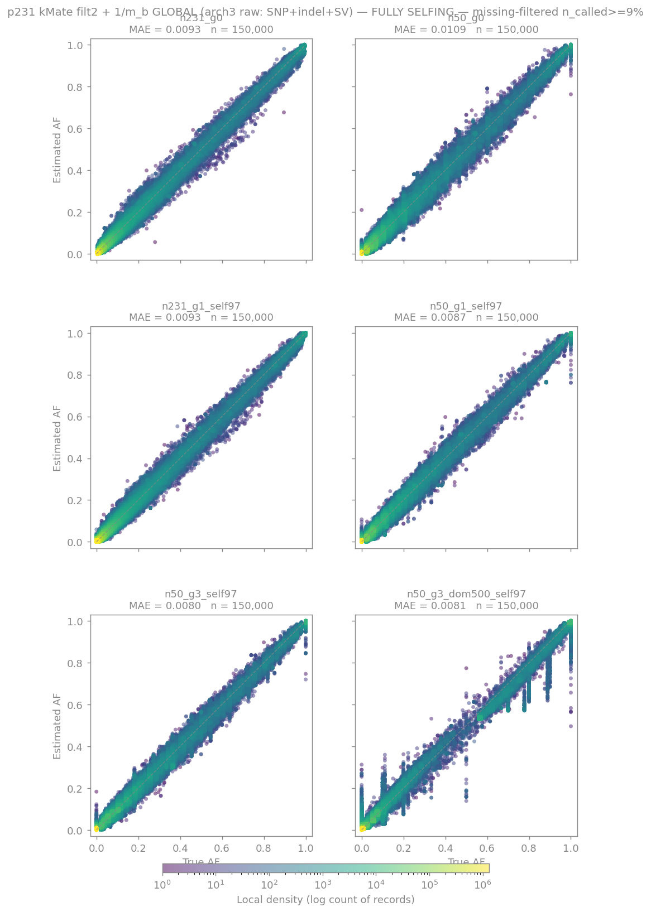

# benchmarks/

End-to-end accuracy benchmarks for the kMate estimator: simulate pool-seq reads from
a known founder mixture, run the full pipeline, and compare estimated allele
frequencies against the simulation truth.

Both benchmarks drive the shared pool-seq simulation framework in
[`../sims/`](../sims/) (mosaic construction → VISOR pooled read simulation →
truth tables; see `../sims/README.md` and `../docs/SIMULATIONS_METHODS.md`) and
the estimator in `../src/`.

## Headline accuracy — fully-selfing, p231

Under biologically realistic **97% selfing** (the regime *A. thaliana* actually
experiences — >97% selfing), kMate recovers per-record allele frequencies with
**MAE ≈ 0.008–0.011 (R² > 0.99)** across *every* regime — g0 → g1 → g3, the
"perfect-mix" N=231 pool, and the selection case (one ecotype sweeping to 50%
frequency) — and across SNPs, indels, **and SVs** in a single pass. Panel below:
p231, fully-selfing scenario, GLOBAL mode, records with >90% of founders missing
filtered out (`n_called ≳ 10% of founders`).



The full figure set — both scenarios (`outcross`/`selfing`) × both estimator modes
(`global`/`window`) × missing-filter levels (`no-filter`/`miss50`/`miss90`), per
panel — lives in `{p231,p80}/results/plots/{panel}_{scenario}_{mode}[_miss50|_miss90].png`,
generated by [`plot_scenario_grids.py`](plot_scenario_grids.py) through the shared
density-scatter aesthetic in [`_accuracy_panel.py`](_accuracy_panel.py). (The
forced-outcross scenario is the deliberately-unrealistic worst case; only its
recombinant regimes — g3, dom500 — degrade, and window mode partly recovers them.)

| dir | panel | what it isolates |
|---|---|---|
| `p80/` | **homogeneous** 80-cactus-founder panel (all long-read assemblies, no PanGenie founders) | Control: with no cactus-vs-PanGenie k-mer asymmetry, does the +41% h-bias and the off-diagonal streak vanish? Established the **panel-conditional caveat** that ω_k=1/m_b slightly under-performs uniform EM on a balanced panel. |
| `p231/` | **full** production 231-founder panel (78 cactus + 153 PG) | Headline benchmark on the real heterogeneous panel kMate ships against, across the regime matrix (coverage, generations, recombination, skew). |

Each benchmark dir follows the same numbered-stage layout:

```
NN_*.sh        # build panel inputs → simulate → run estimator → evaluate
scripts/       # stage scripts + sim-mosaic builders
sims/          # per-panel sim outputs (gitignored; regeneratable)
results/       # FINAL_RESULTS_*.ipynb + summary TSVs + plots
```

See each subdir's `README.md` for the stage-by-stage walk-through. Results notebooks
(`results/FINAL_RESULTS_*.ipynb`) hold the regime-by-method MAE tables and figures.

> Historical note: `p80/` succeeds the earlier `control_p82/` control (dropped after the
> 2026-05-16 panel-QC decisions removed 2 cactus assemblies).
